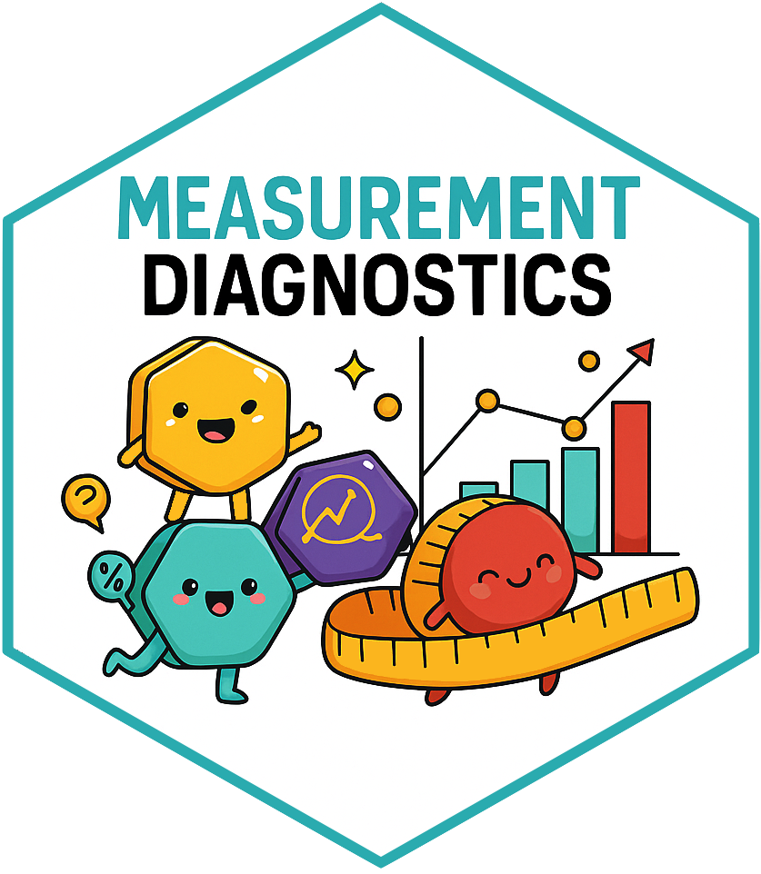

<!-- README.md is generated from README.Rmd. Please edit that file -->

```{r, include = FALSE}
knitr::opts_chunk$set(
  collapse = TRUE,
  comment = "#>",
  fig.path = "man/figures/README-",
  out.width = "100%"
)
```

<!-- README.md is generated from README.Rmd. Please edit that file -->

# MeasurementDiagnostics 

<!-- badges: start -->
[](https://github.com/OHDSI/MeasurementDiagnostics/actions)
[](https://app.codecov.io/gh/OHDSI/MeasurementDiagnostics?branch=main)
[](https://lifecycle.r-lib.org/articles/stages.html#experimental)

<!-- badges: end -->

The MeasurementDiagnostics package helps us to assess the use of measurements present in data mapped to the OMOP CDM, either for the dataset as a whole or for a particular cohort.

## Installation

You can install the development version of MeasurementDiagnostics from [GitHub](https://github.com/) with:

``` r
# install.packages("pak")
pak::pak("ohdsi/MeasurementDiagnostics")
```

## Example

Let's say we are going to do a study where we are going to be using measurements of respiratory function. We can use MeasurementDiagnostics to better understand the use of these measurements.

For this example we'll use the Eunomia data. 

```{r, warning=FALSE}
library(duckdb)
library(omopgenerics)
library(CDMConnector)
library(dplyr)
library(MeasurementDiagnostics)
```

```{r, message=TRUE}
con <- dbConnect(duckdb(), dbdir = eunomiaDir())
cdm <- cdmFromCon(
  con = con, cdmSchem = "main", writeSchema = "main", cdmName = "Eunomia"
)
cdm
```

Now we have a cdm reference with our data, we will create a codelist with measurement concepts.
```{r}
repiratory_function_codes <- newCodelist(list("respiratory function" = c(4052083L, 4133840L, 3011505L)))
repiratory_function_codes
```

And now we can run a set of measurement diagnostic checks, here stratifying results by sex.
```{r}
repiratory_function_measurements <- summariseMeasurementUse(cdm, repiratory_function_codes, bySex = TRUE)
```

Among our results is a summary of timings between measurements for individuals in our dataset. We can quickly create a plot of these results like so
```{r}
plotMeasurementTimings(repiratory_function_measurements)
```
