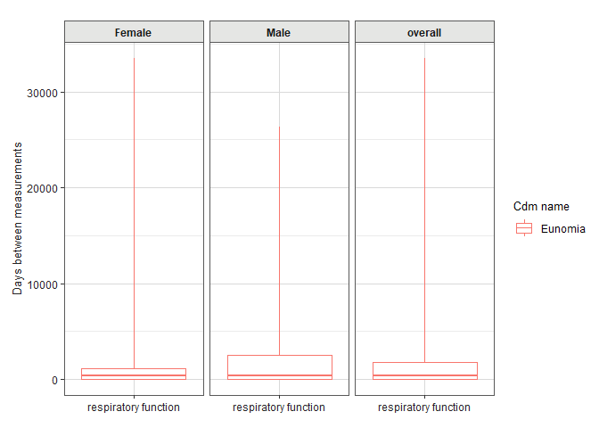

<!-- README.md is generated from README.Rmd. Please edit that file -->
<!-- README.md is generated from README.Rmd. Please edit that file -->

# MeasurementDiagnostics 

<!-- badges: start -->

[](https://github.com/OHDSI/MeasurementDiagnostics/actions)
[](https://app.codecov.io/gh/OHDSI/MeasurementDiagnostics?branch=main)
[](https://lifecycle.r-lib.org/articles/stages.html#experimental)

<!-- badges: end -->

The MeasurementDiagnostics package helps us to assess the use of
measurements present in data mapped to the OMOP CDM, either for the
dataset as a whole or for a particular cohort.

## Installation

You can install the development version of MeasurementDiagnostics from
[GitHub](https://github.com/) with:

``` r
# install.packages("pak")
pak::pak("ohdsi/MeasurementDiagnostics")
```

## Example

Let’s say we are going to do a study where we are going to be using
measurements of respiratory function. We can use MeasurementDiagnostics
to better understand the use of these measurements.

For this example we’ll use the Eunomia data.

``` r
library(duckdb)
#> Loading required package: DBI
library(omopgenerics)
#> 
#> Attaching package: 'omopgenerics'
#> The following object is masked from 'package:stats':
#> 
#>     filter
library(CDMConnector)
library(dplyr)
#> 
#> Attaching package: 'dplyr'
#> The following objects are masked from 'package:stats':
#> 
#>     filter, lag
#> The following objects are masked from 'package:base':
#> 
#>     intersect, setdiff, setequal, union
library(MeasurementDiagnostics)
```

``` r
con <- dbConnect(duckdb(), dbdir = eunomiaDir())
#> Creating CDM database C:/Users/nmercade/Dropbox/Documents/IDIAP/Formations/Curs_Introduccio_OMOP/MockDB/GiBleed_5.3.zip
#> ■■■■■■■■■■■■■■■■                  51% | ETA:  2s
#> ■■■■■■■■■■■■■■■■■■■               61% | ETA:  2s
#> ■■■■■■■■■■■■■■■■■■■■■             66% | ETA:  1s
#> ■■■■■■■■■■■■■■■■■■■■■■■■          78% | ETA:  1s
#> ■■■■■■■■■■■■■■■■■■■■■■■■■■        83% | ETA:  1s
#>                                                  
cdm <- cdmFromCon(
  con = con, cdmSchem = "main", writeSchema = "main", cdmName = "Eunomia"
)
cdm
#> 
#> ── # OMOP CDM reference (duckdb) of Eunomia ────────────────────────────────────
#> • omop tables: person, observation_period, visit_occurrence, visit_detail,
#> condition_occurrence, drug_exposure, procedure_occurrence, device_exposure,
#> measurement, observation, death, note, note_nlp, specimen, fact_relationship,
#> location, care_site, provider, payer_plan_period, cost, drug_era, dose_era,
#> condition_era, metadata, cdm_source, concept, vocabulary, domain,
#> concept_class, concept_relationship, relationship, concept_synonym,
#> concept_ancestor, source_to_concept_map, drug_strength
#> • cohort tables: -
#> • achilles tables: -
#> • other tables: -
```

Now we have a cdm reference with our data, we will create a codelist
with measurement concepts.

``` r
repiratory_function_codes <- newCodelist(list("respiratory function" = c(4052083L, 4133840L, 3011505L)))
repiratory_function_codes
#> 
#> ── 1 codelist ──────────────────────────────────────────────────────────────────
#> 
#> - respiratory function (3 codes)
```

And now we can run a set of measurement diagnostic checks, here
stratifying results by sex.

``` r
repiratory_function_measurements <- summariseMeasurementUse(cdm, repiratory_function_codes, bySex = TRUE)
#> → Getting measurement records based on 3 concepts.
#> → Subsetting records to the subjects and timing of interest.
#> Warning: cohort_name must be snake case and have less than 100 characters, the following
#> cohorts will be renamed:
#> • respiratory function_4052083 -> respiratory_function_4052083
#> • respiratory function_4133840 -> respiratory_function_4133840
#> • respiratory function_3011505 -> respiratory_function_3011505
#> → Getting time between records per person.
#> → Summarising results - value as number.
#> → Summarising results - value as concept.
#> → Binding all diagnostic results.
```

Among our results is a summary of timings between measurements for
individuals in our dataset. We can quickly create a plot of these
results like so

``` r
plotMeasurementTimings(repiratory_function_measurements)
```


